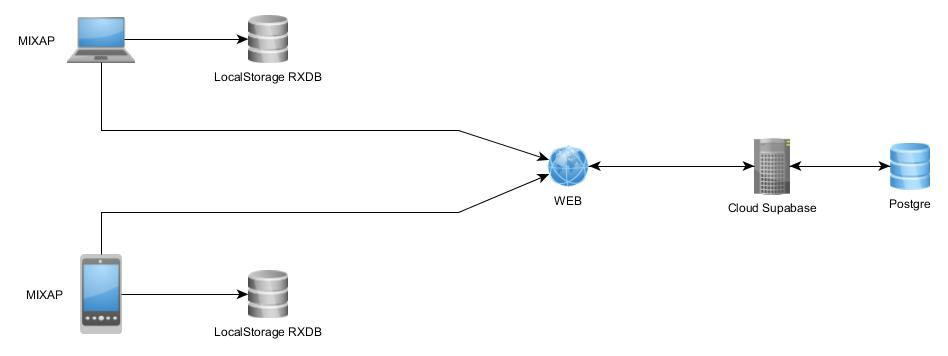

# MIXAP 

infos pugins important : 

- "rxdb version 13.17.1 (Bdd dans indexDB)
- "rxdh-hooks ^4.0.3 (permet de faire les reqûetes sur la bdd du indexDB)
- "vite": "5.1.4"
- "vite-plugin-checker": "^0.6.4"
- "vite-plugin-pwa": "^0.19.1"
- "vite-plugin-require": "^1.2.14"
- "vite-plugin-svgr": "^4.2.0"
- "vite-tsconfig-paths": "4.3.1"
- "vue": "^3.4.27"
- "vite-plugin-node-polyfills": "^0.22.0"

## Prérequis

NVM

Installation de nvm

```
curl -o- https://raw.githubusercontent.com/nvm-sh/nvm/v0.39.7/install.sh | bash

export NVM_DIR="$([ -z "${XDG_CONFIG_HOME-}" ] && printf %s "${HOME}/.nvm" || printf %s "${XDG_CONFIG_HOME}/nvm")"
[ -s "$NVM_DIR/nvm.sh" ] && \. "$NVM_DIR/nvm.sh" # This loads nvm

```

Le projet tourne sous une version de nodeJS 18

## Fonctionnement



## Installation

Clonez le repo

```
git clone http://SRV-GITLAB.HOKOHA.local/CODE_SOURCE/mixap.git
```

Installez Docker

    https://www.docker.com/products/docker-desktop/

Installez ensuite Supabase en local


```
make db_install
```

Configurez ensuite la base de données supabase, suivre la procédure du document 
```
 docs/Configuration_Supabase.pdf 
```

Une fois la base de données configurée, installez MIXAP 

```
make install
```
Une fois MIXAP installé, tapez cette commande :

```
make db_status
```
Copier le annoy key

Dans le .env 

```
VITE_APP_SUPABASE_URL= "http://localhost:54321"
VITE_APP_SUPABASE_ANON_KEY= "ANNOY_KEY_PRECEDEMMENT_COPIER"
VITE_APP_TRACE=

```
Attention si les variables d'environnement ne commencent pas par 'VITE_' elles ne seront pas lues.

Relancer le container

```
make down
make start
```


Une fois cela fait rendez-vous sur https://localhost:3000

## Documentation de couchDb (permet de faire les requêtes)
https://docs.couchdb.org/en/stable/api/database/find.html

